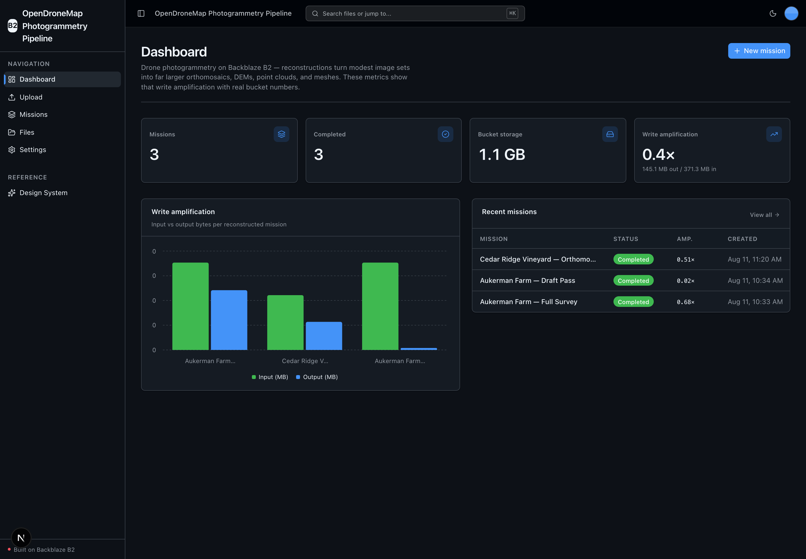
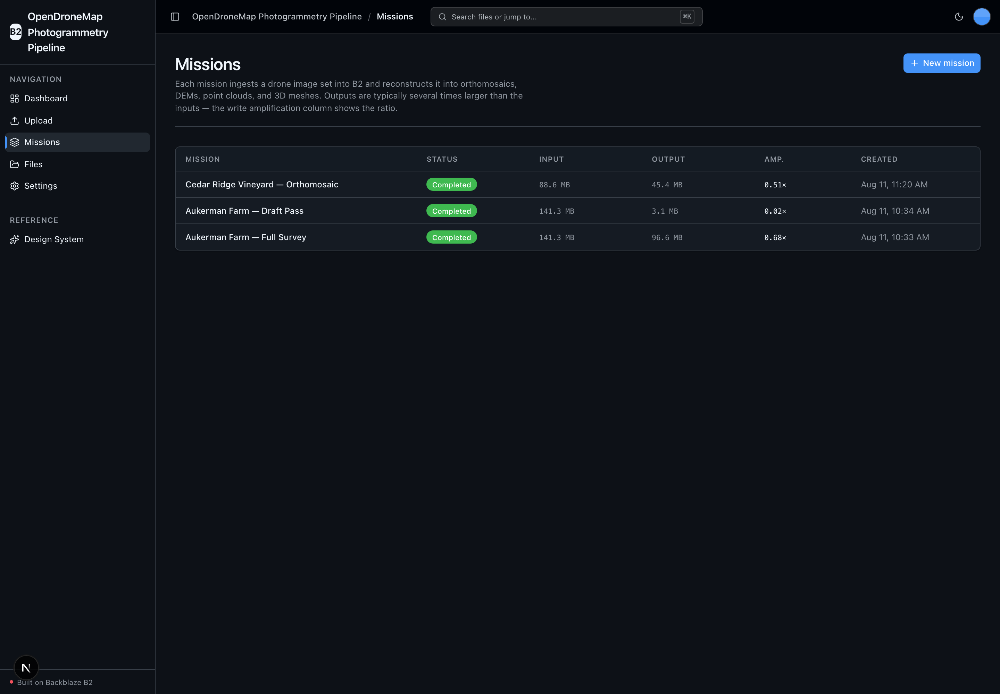
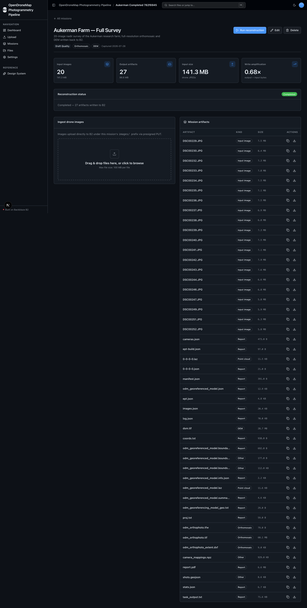
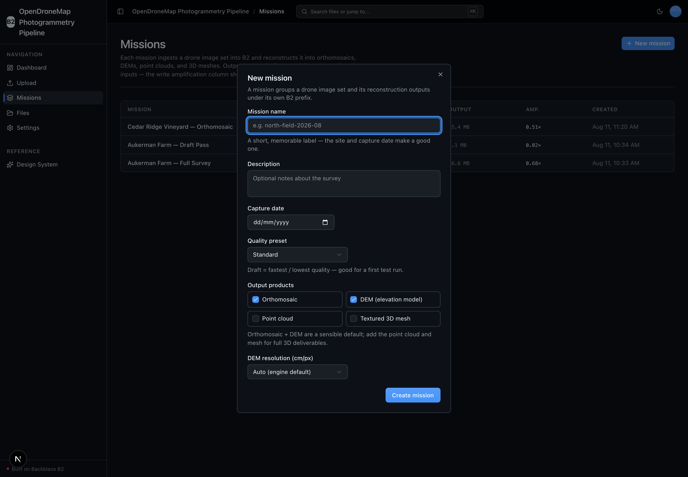
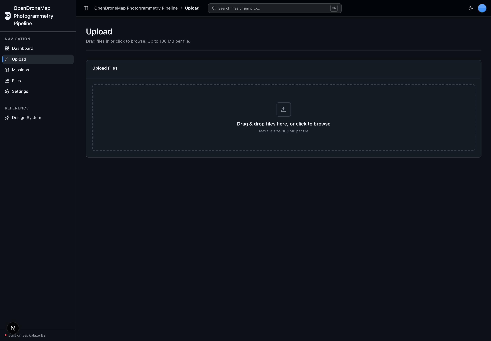

<!-- last_verified: 2026-08-11 -->
# OpenDroneMap Photogrammetry Pipeline

Ingest large sets of overlapping drone JPEGs into **[Backblaze B2](https://www.backblaze.com/sign-up/ai-cloud-storage?utm_source=github&utm_medium=referral&utm_campaign=ai_artifacts&utm_content=b2ai-opendronemap-photogrammetry-pipeline)**, reconstruct them with **[OpenDroneMap](https://www.opendronemap.org/)** into publication-quality orthomosaics, DEMs, dense point clouds, and textured 3D meshes, and write those far-larger outputs back to B2 for GIS analysis and client delivery. It is a working sample for surveying firms, agricultural drone operators, and GIS teams — a full-stack TypeScript + Python app with B2 wired in through the S3-compatible API only.

Its whole point is **extreme write amplification**: a modest input image set produces outputs several times larger, and B2 is the durable storage layer holding both. The reconstruction runs on local open-source software (OpenDroneMap via NodeODM) — **there is no second API key; B2 credentials only.**

Explore the [OpenDroneMap Photogrammetry Pipeline project page](https://backblazelabs.com/projects/opendronemap-photogrammetry-pipeline/), the official [Backblaze B2 AI integrations and sample applications](https://www.backblaze.com/cloud-storage/b2-ai-integrations) directory, and the checked-in [local OpenAPI contract](docs/api/openapi.json).

**What you get out of the box:**
- A **Mission** workflow: create → ingest drone images → run reconstruction → browse and download artifacts → delete, all backed by B2 (no database — missions are JSON manifests in the bucket)
- Local **OpenDroneMap** engine via NodeODM (CPU, containerized) — orthomosaic, DEM, point cloud, and textured mesh
- Write-amplification analytics computed from real bucket sizes (output bytes ÷ input bytes)
- A mission-scoped artifact explorer **and** the starter's full-bucket file browser
- FastAPI backend with strict layered architecture, structural tests, and an S3-only B2 boundary
- Agent-optimized docs — your AI coding agent can read the repo and start contributing immediately

## What it looks like

**Dashboard** — write-amplification metrics, an input-vs-output bytes chart, and recent missions, all computed from real B2 bucket sizes.



**Missions** — every reconstruction job with its status, input and output sizes, and write-amplification ratio.



**Mission detail** — a completed mission's stats plus the full artifact list (orthomosaic, DEM, point cloud, and reports) written back to B2.



**New mission** — configure a survey's name, capture date, quality preset, and output products before ingesting drone images.



**Upload** — the starter's direct-to-B2 uploader for dropping files straight into the bucket via presigned PUT.



## Quick Start

You need: Node.js >= 20, pnpm >= 9, Python >= 3.12, **Docker** (for the local NodeODM engine), and a free **[Backblaze B2 account](https://www.backblaze.com/sign-up/ai-cloud-storage?utm_source=github&utm_medium=referral&utm_campaign=ai_artifacts&utm_content=b2ai-opendronemap-photogrammetry-pipeline)**.

### Supported local environments

Local scripts are supported on macOS, Linux, and WSL2. Native Windows is not
supported yet because the dev scripts use POSIX shell syntax and
`services/api/.venv/bin/*` paths; use WSL2 on Windows.

The OpenDroneMap engine (NodeODM) is CPU-based and containerized — **no GPU is
required**. Running a full reconstruction needs Docker running locally and
enough disk for the intermediate and output artifacts.

### Setup

**1. Run setup**

```bash
pnpm run setup
```

This copies `.env.example` to `.env` only when `.env` does not already exist,
installs workspace dependencies from `pnpm-lock.yaml`, creates
`services/api/.venv` if missing, validates that an existing venv uses Python
3.12+, and installs the API's committed Python 3.12 resolution from
`services/api/requirements.lock`. It is safe to rerun and never overwrites an
existing `.env`.

> Use the `pnpm run` form: `setup` (like `doctor`) is a built-in pnpm command
> before pnpm 11, so bare `pnpm setup` would run pnpm's own command instead of
> this script.

**2. Add your B2 credentials**

Open `.env` and head to the [Backblaze B2 dashboard](https://secure.backblaze.com/b2_buckets.htm?utm_source=github&utm_medium=referral&utm_campaign=ai_artifacts&utm_content=b2ai-opendronemap-photogrammetry-pipeline):

1. **Create a bucket** → paste its unique name into `B2_BUCKET_NAME`, and set
   `B2_REGION` to the bucket's region (e.g. `us-west-004`). The S3 endpoint is
   **derived** from the region (`https://s3.<region>.backblazeb2.com`), so there
   is no endpoint URL to keep in sync.
2. **Create an application key** with `Read and Write` permission:
   - **keyID** → `B2_APPLICATION_KEY_ID`
   - **applicationKey** → `B2_APPLICATION_KEY` *(only shown once — paste it now)*

> Want a walkthrough? See the docs for [creating a bucket](https://www.backblaze.com/docs/cloud-storage-create-and-manage-buckets) and [creating app keys](https://www.backblaze.com/docs/cloud-storage-create-and-manage-app-keys).

**3. Start the OpenDroneMap engine**

```bash
docker compose up -d
```

This starts NodeODM (the OpenDroneMap REST API) on `http://localhost:3001`. The
backend reaches it via `ODM_NODE_URL` (default `http://localhost:3001`). It is a
CPU image — no GPU required.

**4. (Optional) Seed a demo mission**

```bash
services/api/.venv/bin/python services/api/scripts/seed_mission.py
```

Downloads a small public/CC-licensed OpenDroneMap sample image set, uploads it
to B2 under a demo mission prefix, and writes the mission manifest — so a fresh
clone has one runnable mission. See the script header for the dataset and its
license.

**5. Run it**

```bash
pnpm dev
```

Frontend at `localhost:3000`, API at `localhost:8000`. Create a mission, upload
drone images, and run the reconstruction. Interactive API docs (Swagger UI) are
at `localhost:8000/docs`, with ReDoc at `/redoc`.

`pnpm dev` runs the preflight check first — it catches the common setup gotchas
(wrong Node/Python version, missing venv, missing or placeholder `.env`, ports
already taken) and tells you how to fix each one. Run it any time with
`pnpm run doctor`.

## When to use

Use this repository when you need a working example of a **high-volume,
write-heavy B2 workload**: turning drone imagery into large geospatial
deliverables and keeping both inputs and outputs durably in object storage,
accessed exclusively through the S3-compatible API. It is a good starting point
for surveying, agriculture, and GIS teams who want B2 as the storage layer for a
photogrammetry pipeline, and a good reference for the Mission CRUD-plus-run
pattern over B2 JSON manifests.

## When not to use

Do not choose this repository expecting a complete hosted SaaS product or a
drop-in production service. It does not provide managed hosting, user accounts,
authentication, tenant isolation, billing, or on-call operations. The
reconstruction engine is local OpenDroneMap; this is not a managed
photogrammetry service. Before using an adapted application in production, you
own its product-specific security, operations, capacity, compliance, and support
decisions.

## Building Your App

This app is built on the Backblaze B2 vibe-coding starter kit. When you adapt it,
keep the shared scaffolding and only swap out what's app-specific:

- **Keep** the UI kit (`apps/web/src/components/ui/` + design tokens in `globals.css` + `/design`).
- **Keep** the full-bucket File Explorer (`/files`) and generic Upload (`/upload`) pages — they're the reusable B2-backed surface.
- **Study** the Missions feature (`/missions`) as the model for a primary entity persisted as B2 JSON manifests with a folder-scoped artifact explorer.
- **Rebrand** by editing a single file: `apps/web/src/lib/app-config.ts` holds the app name and description (`APP_NAME`, `APP_DESCRIPTION`).

Full contract and rationale: [AGENTS.md §2 — Building on This Starter Kit](AGENTS.md#2-building-on-this-starter-kit).

## Core Features

- [Missions](docs/features/missions.md) — the primary entity: create, read, edit, delete, and **run** a photogrammetry job. Persisted as a JSON manifest in B2.
- [Reconstruction](docs/features/reconstruction.md) — the marquee action: OpenDroneMap (NodeODM) produces orthomosaic, DEM, point cloud, and textured mesh; outputs are written back to B2 with managed multipart transfer.
- [Mission ingest](docs/features/file-upload.md) — group and upload overlapping drone JPEGs into a mission's B2 prefix via presigned direct-to-B2 PUT.
- [File Browser](docs/features/file-browser.md) — the kept full-bucket explorer: list, preview, download, delete every object.
- [Dashboard](docs/features/dashboard.md) — write-amplification metrics and recent missions.
- [Artifact metadata](docs/features/metadata-extraction.md) — geospatial artifact classification (orthomosaic / DEM / point cloud / mesh) plus the generic object detail extraction.
- [Design System](docs/design-system.md) — tokens, primitives, and inline `ErrorState` / `EmptyState` patterns. Live preview at `/design`.

- Checked local API contract — [`docs/api/openapi.json`](docs/api/openapi.json) plus `pnpm contract:check` catch FastAPI/client route drift.
- Structural tests — verify layering rules, import boundaries, SDK containment (`boto3` and `pyodm` only in `repo/`), and the 300-line file limit.
- Structured JSON logging, `/health` (B2 connectivity), `/metrics` (Prometheus), and per-IP rate limiting — see [SECURITY.md](docs/SECURITY.md).

## Tech Stack

- TypeScript, Next.js 16, React 19, Tailwind v4, shadcn/ui, Recharts
- TanStack Query — caching, dedup, retry, stale-while-revalidate for every fetch
- Python 3.12+, FastAPI, boto3, Pydantic v2, Pillow
- **OpenDroneMap** via [`pyodm`](https://github.com/OpenDroneMap/PyODM) + the NodeODM REST API (local, CPU, containerized)
- Backblaze B2 (S3-compatible object storage)
- pnpm workspaces (monorepo)

## Commands

| Command | What it does |
|---------|-------------|
| `pnpm run setup` | Idempotently copy `.env.example` to `.env` only if missing, install workspace dependencies, create the backend venv, and install the locked API dependencies |
| `pnpm run doctor` | Preflight environment check (also runs automatically before `pnpm dev`) |
| `pnpm dev` | Start frontend + backend |
| `pnpm dev:web` | Frontend only |
| `pnpm dev:api` | Backend only |
| `pnpm contract:export` | Export deterministic FastAPI OpenAPI JSON to `docs/api/openapi.json` |
| `pnpm contract:check` | Verify the checked-in OpenAPI artifact and frontend API client route registry |
| `pnpm check:agent-docs` | Validate agent shims, command docs, CI claims, and `.env` ignore coverage |
| `pnpm verify` | Credential-free canonical non-live pre-PR suite — runs `check:agent-docs`, `verify:api`, then `verify:web` |
| `pnpm verify:api` | Backend half: API lint, API tests, structure tests |
| `pnpm verify:web` | Frontend half: web lint, web unit tests, web typecheck + build |
| `pnpm verify:full` | `pnpm run doctor`, then `pnpm verify`, then Playwright E2E; requires populated `.env`, local server/browser permission, port 3000 free, and Chromium installed |
| `pnpm build` | Build frontend |
| `pnpm lint` | Lint frontend |
| `pnpm lint:api` | Lint backend (ruff) |
| `pnpm test:web` | Run frontend unit tests (vitest) |
| `pnpm test:api` | Run backend tests |
| `pnpm test:live:b2` | Opt-in real B2 connectivity test; requires `RUN_LIVE_B2_TESTS=1` and non-production credentials |
| `pnpm check:structure` | Verify layering rules |
| `pnpm test:e2e` | Playwright E2E smoke tests (run `pnpm --filter @opendronemap-photogrammetry-pipeline/web exec playwright install chromium` once first) |

Run `pnpm run setup` once before local development, and rerun it after pulling
dependency changes. `pnpm verify` needs neither B2 credentials, a NodeODM
engine, nor a browser — unit tests mock `pyodm` and B2. Run it before opening a
PR. For an API dependency change, follow the reviewed refresh workflow in
[docs/dev-workflows.md](docs/dev-workflows.md#python-dependency-updates).

## Deploying to Vercel

The web app and FastAPI API deploy to Vercel as **one project** (web at `/`, API
under `/api`) — one origin, no CORS. Note that the reconstruction step needs a
reachable NodeODM engine (`ODM_NODE_URL`); Vercel Functions cannot run the
containerized engine, so a hosted deploy points at a NodeODM you host elsewhere,
while the mission CRUD, ingest, and artifact browsing work as-is.

[](https://vercel.com/new/clone?repository-url=https%3A%2F%2Fgithub.com%2Fbackblaze-b2-samples%2Fopendronemap-photogrammetry-pipeline&project-name=opendronemap-photogrammetry-pipeline&env=B2_APPLICATION_KEY_ID,B2_APPLICATION_KEY,B2_REGION,B2_BUCKET_NAME&envDescription=B2%20credentials%20and%20bucket&envLink=https%3A%2F%2Fgithub.com%2Fbackblaze-b2-samples%2Fopendronemap-photogrammetry-pipeline%2Fblob%2Fmain%2Finfra%2Fvercel%2FREADME.md)

Set the B2 credentials, region, and bucket. Uploads go **directly from the
browser to B2** (presigned PUT), so Vercel's 4.5 MB Function payload limit
doesn't apply. For the full variable classification, security controls, and
rollback, follow the [Vercel delivery contract](infra/vercel/README.md).
Deploying is a human-approved action — nothing here performs one for you.

## Documentation Map

| Doc | Purpose |
|-----|---------|
| [AGENTS.md](AGENTS.md) | Agent table of contents — start here |
| [ARCHITECTURE.md](ARCHITECTURE.md) | System layout, layering, data flows |
| [docs/features/](docs/features/) | Feature docs (missions, reconstruction, ingest, browser, dashboard, metadata) |
| [docs/app-workflows.md](docs/app-workflows.md) | User journeys |
| [docs/dev-workflows.md](docs/dev-workflows.md) | Engineering workflows and testing |
| [docs/SECURITY.md](docs/SECURITY.md) | Security principles |
| [docs/RELIABILITY.md](docs/RELIABILITY.md) | Reliability expectations |
| [docs/api/openapi.json](docs/api/openapi.json) | Checked contract for the local FastAPI API |
| [infra/vercel/README.md](infra/vercel/README.md) | Vercel deployment contract |
| [docs/exec-plans/](docs/exec-plans/) | Execution plans and tech debt tracker |

## FAQ

**What is the OpenDroneMap Photogrammetry Pipeline?**
A full-stack sample app (Next.js 16 + FastAPI) that ingests drone imagery into Backblaze B2, reconstructs it with OpenDroneMap into orthomosaics, DEMs, point clouds, and 3D meshes, and stores those outputs back in B2. It demonstrates a high-volume, write-heavy B2 workload accessed only through the S3-compatible API.

**Do I need a GPU?**
No. OpenDroneMap's pipeline (OpenSfM / OpenMVS) is CPU-based and runs in the containerized NodeODM engine. A GPU is never required.

**Does it need a second API key or a cloud AI provider?**
No. The reconstruction engine is local open-source OpenDroneMap. The only credentials are your Backblaze B2 application key.

**Where does mission data live? Is there a database?**
There is no database. Each mission is a JSON manifest in B2 at `missions/<id>/mission.json`; inputs live under `missions/<id>/images/` and generated artifacts under `missions/<id>/outputs/`.

**Is it free?**
The code is MIT-licensed (see [License](#license)). Backblaze B2 offers a free account to get started; you pay for storage of the (often large) reconstruction outputs. OpenDroneMap is free and open-source.

**Can I use it in production?**
It's a sample Backblaze maintains to help developers get started with B2. Production use is possible with caution and requires your own validation — see [When not to use](#when-not-to-use) and [Maintenance and support](#maintenance-and-support).

**Does it include authentication or multi-tenant isolation?**
No. Add whatever your application requires on top of the scaffold. The API is unauthenticated and bucket-wide by design.

**Do I have to use Backblaze B2?**
It integrates Backblaze B2 through the S3-compatible API, and B2 is the storage the app is built around. You supply your own bucket and application key during setup.

**Does it work on Windows?**
Local scripts are supported on macOS, Linux, and WSL2. Native Windows is not supported yet — use WSL2.

**Where do I get help or report bugs?**
Report repository defects and feature requests through [GitHub Issues](https://github.com/backblaze-b2-samples/opendronemap-photogrammetry-pipeline/issues). For B2 account, billing, service, or API help, use [Backblaze Support](https://www.backblaze.com/help).

## Maintenance and support

Backblaze maintains this open-source sample to help developers get started with
B2. Production use is possible with caution and requires your own validation.
Report repository defects and feature requests through
[GitHub Issues](https://github.com/backblaze-b2-samples/opendronemap-photogrammetry-pipeline/issues);
for B2 account, billing, service, or API help, use
[Backblaze Support](https://www.backblaze.com/help). This sample is not covered
by the Backblaze service level agreement, and no SLA is provided for the
repository software; any B2 service or support commitments are governed
separately by the applicable Backblaze terms and support plan.

## Contributing

Start with [AGENTS.md](AGENTS.md). It's the map — everything else is discoverable
from there. For local commit hooks, follow [the pre-commit workflow](docs/dev-workflows.md#pre-commit).

## License

MIT License - see [LICENSE](LICENSE) for details.

## Claude Agent B2 Skill

Manage Backblaze B2 from your terminal using natural language (list/search, audits, stale or large file detection, security checks, safe cleanup).

Repo: [https://github.com/backblaze-b2-samples/claude-skill-b2-cloud-storage](https://github.com/backblaze-b2-samples/claude-skill-b2-cloud-storage)
